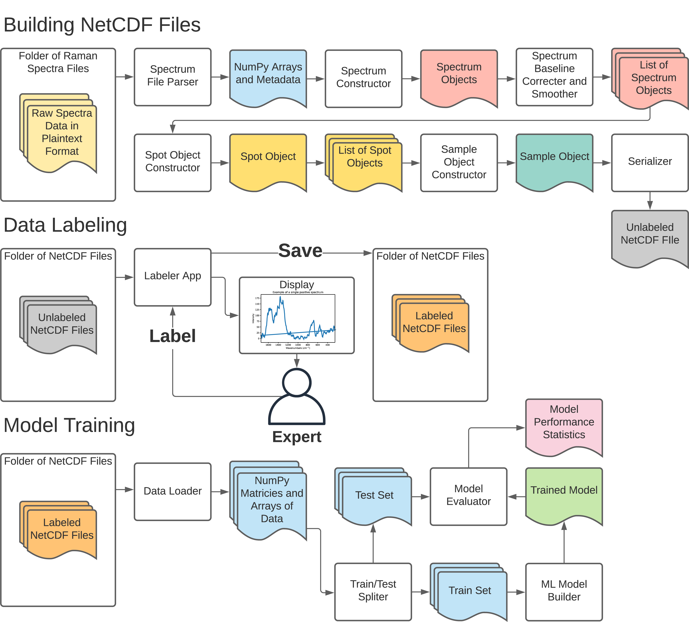

# Raman Box

The Raman Box Python package consists of a series of Python objects to organize and store Raman spectra from Surface Enhanced Raman Spectroscopy (SERS) experiments. This package was utilized in our recent publication in Applied Spectroscopy, [Machine Learning-Assisted Sampling of SERS Substrates Improves Data Collection Efficiency](https://doi.org/10.1177/00037028211034543). 



## Installation 
1.	Clone the ramanbox repository ``https://github.com/kul-group/ramanbox``
2.	Use terminal to navigate to the cloned repo directory ``cd ramanbox```
3.	Run the command 
`pip install -e .`

Note that for an unknown reason `pip install .` does not work. 


## Usage 

### Building NetCDF Files 

The spectra collected from your instrument should exported to a plaintext file. Each sample should have its own folder and each folder should contain one or many text files representing the spectra. To label the spectra for analysis you will need to convert them to binary netCDF files. This can be achieved by using the pipeline functions. 

These pipeline functions were designed for the plaintext output files of our instrument, which look like this:

```batch 
Date and Time:                Wed Feb 26 23:17:06.291 2020
Software Version:             4.30.30034.0
... [skipping meta data] 
Direct Iris Steps:            56


797.49231	399	
797.61133	401	
797.73035	401	
...
917.79956	331	
```

Multiple spectra are generally contained within each text file. If you have your own spectra with a unique format you will have to create your own parser. 

If you have a different spectra or spot layout than you should create your own pipeline function by using the existing ones as guides. 

```python
from ramanbox.pipeline.pipelines import raw_raster_to_unlabeled_netcdf, raw_sample_to_unlabeled_netcdf

input_dir = 'input'
output_dir = 'output' 
#raw_raster_to_unlabeled_netcdf(input_dir, output_dir)
raw_sample_to_unlabeled_netcdf(input_dir, output_dir)
```

After creating unlabeled netCDF files it is time to label them. This can be achieved by using the Labeler Application. 

## Launching Labeler App

1. Find the output path for your unlabeled netCDF files
2.	Navigate to the cloned repo
3.	Open the ``labeling_app.py`` file in the root directory
4.	Edit the file so that the ``unlabeled_data_dir`` matches your directory and the ``labeled_data_dir`` matches your desired output location 
5.	Run the labeler app by running the command 
`python3 labeling_app.py`
6. The labeler app can be used to label spectra either by responding to users clicks or by responding to key presses. 
7. After labeling the spectra be sure to save the changes by pressing the `s` key or clicking the `save` button 

## Machine Learning and Data Analysis 

Check out the Jupyter notebooks in the repo's `Jupyter notebooks` folder for examples on how to filter out negative spectra with ML algorithms. A helpful method is the `Sample` class' `to_pandas` method, which flattens the spectra object into a `Pandas DataFrame` perfect for analysis. 
 

